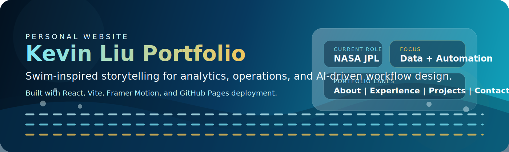
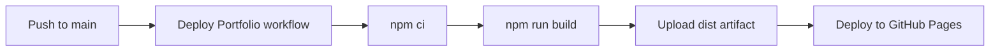

<p align="center">
  
</p>

<p align="center">
  <a href="https://kevinhli.github.io/Personal-website/">
    
  </a>
  <a href="https://github.com/kevinhli/Personal-website/actions/workflows/deploy.yml">
    
  </a>
  
  
  
</p>

<p align="center">
  A swim-inspired portfolio experience for Kevin Liu that turns career milestones, projects, and contact into a motion-driven single-page site.
</p>

## Overview

This project is a personal website built with React, Vite, and Framer Motion. The interface uses a swim-meet concept to guide visitors through four main sections:

| Lane | What it shows |
| --- | --- |
| Intro + About | Background, core skills, and a personal narrative anchored in analytics and swimming |
| Experience | JPL, Oracle, Sonoco, and academic history with awards and education |
| Projects | Work and personal project highlights presented in grouped cards |
| Contact | A direct contact form for roles, projects, and collaboration |

## Stack

| Area | Tools |
| --- | --- |
| Frontend | React 19, Vite 8, Framer Motion, React Icons |
| Styling | Custom CSS with animated, swim-themed visuals |
| Deployment | GitHub Actions + GitHub Pages |

## Local Development

```bash
npm install
npm run dev
```

## Production Checks

```bash
npm run lint
npm run build
npm run preview
```

## Deployment Workflow

The repository is configured for GitHub Pages using [`.github/workflows/deploy.yml`](./.github/workflows/deploy.yml).



## Why the Workflow Works

- The workflow builds on every push to `main` and publishes with `actions/deploy-pages`.
- [`vite.config.js`](./vite.config.js) uses `base: '/Personal-website/'`, which matches the GitHub Pages repository path.
- The project builds successfully with `npm run build` and passes `npm run lint`.

## GitHub Pages Setup

1. Push this repository to the `main` branch.
2. Open `Settings -> Pages` in GitHub.
3. Set the source to `GitHub Actions`.
4. Use the workflow manually or push a new commit to trigger deployment.

The expected live URL is [kevinhli.github.io/Personal-website](https://kevinhli.github.io/Personal-website/).
