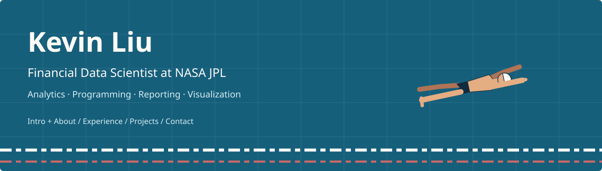
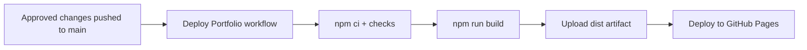

<p align="center">
  
</p>

<p align="center">
  <a href="https://kevinhli.github.io/Personal-website/">
    
  </a>
  <a href="https://github.com/kevinhli/Personal-website/actions/workflows/deploy.yml">
    
  </a>
  
  
  
</p>

## About Kevin

I am Kevin Liu, a Financial Data Scientist at NASA Jet Propulsion Laboratory since September 2026. My background includes data analytics, SQL and Python programming, Power BI reporting, data visualization, operational work, and AI-assisted workflows across JPL, Oracle, Sonoco, and Covestro.

I graduated from the University of Southern California in June 2026 with an M.S. in Computer Science focused on Applied Data Science. My undergraduate degree is in Operations and Supply Chain Management with a concentration in Data Analytics from the University of South Carolina. I was a varsity swimmer and qualified for Olympic Trials twice.

[Live portfolio](https://kevinhli.github.io/Personal-website/) · [LinkedIn](https://www.linkedin.com/in/kevinhumingliu/) · [GitHub](https://github.com/kevinhli)

## The portfolio

This single-page portfolio connects my professional background with swimming. Visitors first meet a human swimmer waiting on the starting block. **Dive In** opens the portfolio through one continuous journey: preparation, launch, airborne extension, hands-first entry, an underwater glide, and ongoing swimming. The scene expands into the four familiar pool checkpoints as the content appears.

Selecting any checkpoint immediately highlights the destination and sends the same swimmer toward it. The content dims briefly, replaces one panel at its midpoint, then returns to full opacity. Rapid selections use the latest destination without queuing intermediate pages or interrupting the swimmer. The pool stays visible on desktop and mobile while content scrolls beneath it; scroll position resets only when a new section appears. Arms follow a continuous, alternating stroke cycle with elbow recovery, leg kicks, body roll, and surface ripples. Direction changes ease through a perspective turn around the vertical axis, with coordinated arm sculling and kicks, then accelerate into the new heading. The swimmer stays active while a visitor reads. Navigation preserves position, travel and angular momentum, and stroke phase, even when a visitor changes direction mid-turn. Wheel navigation works over the pool illustration; arrow keys, Home, and End work while a checkpoint has keyboard focus. URL hashes select the destination after Dive In and support browser Back/Forward within the portfolio.

| Checkpoint | Content |
| --- | --- |
| Intro + About | Introduction, all existing technical skills, swimming background, portrait, and university logos |
| Experience | JPL, Oracle, Sonoco, and Covestro roles, education, and awards |
| Projects | Work projects grouped by employer, including the Natural Language SQL Assistant in development |
| Contact | Contact form and a direct email alternative |

The dive takes 3.6 seconds, followed by a 1.8-second glide into the first checkpoint. Content and every checkpoint become available as soon as Dive In is selected; navigation during entry queues the swimmer's next destination without interrupting the dive. There are no replay or pause controls. Operating-system reduced-motion preferences automatically provide an immediate, static entry and checkpoint changes.

The navigation highlights the selected section while a moving marker and subtle guide stay aligned above the swimmer. The JPL roles share one employer heading and timeline. Data Scientist - Financial Strategy Planning and Analysis contains only its title and **September 2026–Present**; prior responsibilities and Power BI group leadership remain under Earth Science Business Administrator, ending in September 2026.

## Technology and design

The project list omits Badge-In / Badge-Out Status. Personnel Reference Tool states Kevin's supporting development role. Natural Language SQL Assistant uses the supplied query-generation description and an In Development tag; the card does not claim query execution or live database connectivity.

| Area | Implementation |
| --- | --- |
| Frontend | React 19, Vite 8, Framer Motion 12, React Icons |
| Pool and swimmer | One persistent inline SVG scene, a continuous animation clock, fixed-length jointed limbs, damped checkpoint travel, and `requestAnimationFrame` |
| Content transitions | Short Framer Motion fades |
| Styling | Custom CSS, a consistent Manrope type family, and the original pool palette |
| Contact | FormSubmit AJAX endpoint, validation, success/error feedback, and a `mailto:` fallback |
| Deployment | GitHub Actions and GitHub Pages |

Three.js is not used. A side-view SVG makes the head, torso, two arms, and two legs readable at small sizes, without a WebGL context, a model download, or a larger rendering dependency. Bone lengths remain consistent throughout the dive and stroke cycle. The camera follows the entry into the same pool, rather than swapping to a second swimmer illustration. Small ripples and splash droplets begin at hand entry; underwater clipping keeps the waterline legible. Hidden tabs suspend motion time so returning to the page does not skip ahead.

Operating-system reduced-motion preferences disable the dive, button pulse, and ambient animation and make checkpoint travel immediate. Navigation works even when animation frames are unavailable. A JavaScript-disabled fallback provides an introduction and LinkedIn, GitHub, and email links. The portrait keeps its natural aspect ratio. University logos display at matching visible heights, with transparent image padding excluded from their layout and no stretching. The README banner has an intrinsic SVG aspect ratio with no fixed rendered height.

Underwater bubbles use varied sizes, translucent rims and highlights, independent upward drift, and irregular emission timing. Existing bubbles retain their world positions through turns while new trail bubbles follow the swimmer. The shared animation clock and particle limits (26 on desktop, 16 on mobile, with fewer emissions on mobile) keep the effect lightweight. Reduced-motion mode omits the bubble effect.

The pool background uses the original blue depth gradient and gentle static lighting. Grid overlays and repeating wave patterns are removed; quieter lane ropes, the waterline, checkpoint marks, and starting block retain the pool setting.

## Local setup

Use **Node.js 24** and npm, matching the deployment workflow. Install from the lockfile:

```bash
git clone https://github.com/kevinhli/Personal-website.git
cd Personal-website
npm ci
npm run dev
```

Open **http://localhost:5173/Personal-website/**. Vite also prints the complete local URL. In the existing checkout, skip the clone and directory-change steps.

For an isolated local review:

```bash
git switch -c codex/portfolio-review
npm run dev -- --host 127.0.0.1 --port 5173 --strictPort
```

The current implementation is on the local `codex/pool-portfolio-refresh` branch. Local previewing does not push or deploy changes.

## Build, preview, and checks

```bash
npm run lint
npm test
npm run build
npm run preview -- --host 127.0.0.1 --port 4173 --strictPort
```

Open **http://127.0.0.1:4173/Personal-website/** to review the production build. Output is written to `dist/`; preview only serves those files locally.

The Node tests check fixed limb lengths, planted feet while waiting, hands-first entry, dive/glide/swim continuity, coordinated strokes and kicks, travel between every checkpoint pair, and rapid direction changes. Transition tests cover rapid selections, reversals, stale animation callbacks, unmounting, repeated selections, nonzero content opacity, and immediate reduced-motion changes. Use **http://localhost:5173/Personal-website/?motion=reduce** to preview the reduced-motion fallback locally. This QA override is absent from production builds. Reload the page to inspect the full entry sequence again.

Before publishing, verify the four checkpoints, project cards, keyboard navigation, Back/Forward, form validation, image proportions, and reduced motion. Do not send test messages to the live contact endpoint unless you intend to email Kevin.

## GitHub Pages deployment

[`vite.config.js`](./vite.config.js) uses `base: '/Personal-website/'`. Keep this path: the live site is [kevinhli.github.io/Personal-website](https://kevinhli.github.io/Personal-website/). Vite resolves local image, icon, script, and stylesheet URLs under this base.

The existing [deployment workflow](./.github/workflows/deploy.yml) runs on pushes to `main` or manual dispatch. It installs dependencies with Node.js 24, runs checks, builds the site, uploads `dist/`, and publishes using `actions/deploy-pages`.


```mermaid
flowchart LR
  A["Approved changes pushed to main"] --> B["Deploy Portfolio workflow"]
  B --> C["npm ci + checks"]
  C --> D["npm run build"]
  D --> E["Upload dist artifact"]
  E --> F["Deploy to GitHub Pages"]
```

**Publishing requires Kevin's approval of the local preview.** After approval, review and merge into `main`, then push to trigger deployment. Repository **Settings → Pages → Source** must be **GitHub Actions**. Manual workflow dispatch also publishes and should be reserved for an approved release.

## External services and content limitations

- LinkedIn requires sign-in here. Kevin supplied the role transition month and June 2026 graduation date directly; the existing employer and other professional content were retained. Complete profile reconciliation still requires accessible LinkedIn text.
- Internal work projects have no public demos or repository links in the source.
- The original Sonoco role estimates a $3.2M annual opportunity, while its project card says roughly $3M. Both figures are retained pending Kevin's correction.
- FormSubmit requires recipient activation and service availability. Local validation and status handling can be checked without sending email; actual delivery requires an intentional end-to-end submission.
- Google Fonts supplies the existing typefaces. Local sans-serif fallbacks keep text readable if unavailable.
